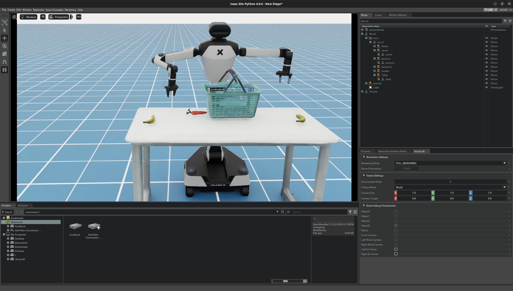

# Galaxea A1 Simulation Isaac Sim Tutorial  

[official tutorial](http://galaxea.tech/Product_User_Guide/Guide/R1/Simulation_Isaac_Lab_Tutorial/#define-observation-action-reward-etc)  

## Installation

As you wish. First, install **Isaac Sim**.  

`git clone https://github.com/userguide-galaxea/Galaxea_Lab.git`  

**From now on, you can refer to the tutorial of** [Isaac Lab binary installation guide](https://isaac-sim.github.io/IsaacLab/main/source/setup/installation/binaries_installation.html#installing-isaac-lab).  

After installation, the robot works well (~stupidly~)   

## Code Reading  
### Minimal Excutable Code Unit  
Path: /source/standalone/galaxea/basic/simple_env.py
~~~py
"""Script to run an environment with zero action agent."""

"""Launch Isaac Sim Simulator first."""

import argparse

from omni.isaac.lab.app import AppLauncher

# add argparse arguments
parser = argparse.ArgumentParser(description="Zero agent for Isaac Lab environments.")
AppLauncher.add_app_launcher_args(parser)
args_cli = parser.parse_args()

# launch omniverse app
app_launcher = AppLauncher(args_cli)

simulation_app = app_launcher.app

"""Rest everything follows."""

import gymnasium as gym  # use openAI Gym as basic environment
import torch

import omni.isaac.lab_tasks  # noqa: F401
from omni.isaac.lab_tasks.utils import parse_env_cfg

def main():
    """Zero actions agent with Isaac Lab environment."""
    env_cfg = parse_env_cfg(
        "Isaac-R1-Lift-Bin-IK-Rel-Direct-v0",  # task_name
        use_gpu= True,
        num_envs= 1,
        use_fabric= True,  # Defines whether to use the current USD for I/O. The default value is True
    )
    # create environment
    env = gym.make("Isaac-R1-Lift-Bin-IK-Rel-Direct-v0", cfg=env_cfg)

    # print info (this is vectorized environment)
    print(f"[INFO]: Gym observation space: {env.observation_space}")
    print(f"[INFO]: Gym action space: {env.action_space}")
    # reset environment
    env.reset()
    # simulate environment
    while simulation_app.is_running():
        # run everything in inference mode
        with torch.inference_mode():
            # compute zero actions
            actions = torch.zeros(env.action_space.shape, device=env.unwrapped.device)
            if True:
                # sample actions from -1 to 1
                actions = (
                    0.05 * torch.rand(env.action_space.shape, device=env.unwrapped.device)
                )
            # apply actions
            env.step(actions)

    # close the simulator
    env.close()

if __name__ == "__main__":
    # run the main function
    main()
    # close sim app
    simulation_app.close()
~~~

### __init__.py
PATH: /source/extensions/omni.isaac.lab_tasks/omni/isaac/lab_tasks/galaxea/direct/lift/__init__.py  
~~~py
##
# Register Gym environments.
##

gym.register(
    id="Isaac-R1-Multi-Fruit-IK-Abs-Direct-v0",  # unique identifier for the environment
    entry_point="omni.isaac.lab_tasks.galaxea.direct.lift:R1MultiFruitEnv",  # spacify the path to the implementation class of the environment
    disable_env_checker=True,  
    kwargs={
        "env_cfg_entry_point": R1MultiFruitAbsEnvCfg,  # spacific configuration
        # "rl_games_cfg_entry_point": f"{agents.__name__}:rl_games_ppo_cfg.yaml",
        # "rsl_rl_cfg_entry_point": agents.rsl_rl_ppo_cfg.FrankaCabinetPPORunnerCfg,
        # "skrl_cfg_entry_point": f"{agents.__name__}:skrl_ppo_cfg.yaml",
    },
)
~~~

### pick_fruit_env.py  
PATH: /source/extensions/omni.isaac.lab_tasks/omni/isaac/lab_tasks/galaxea/direct/lift/pick_fruit_env.py  

