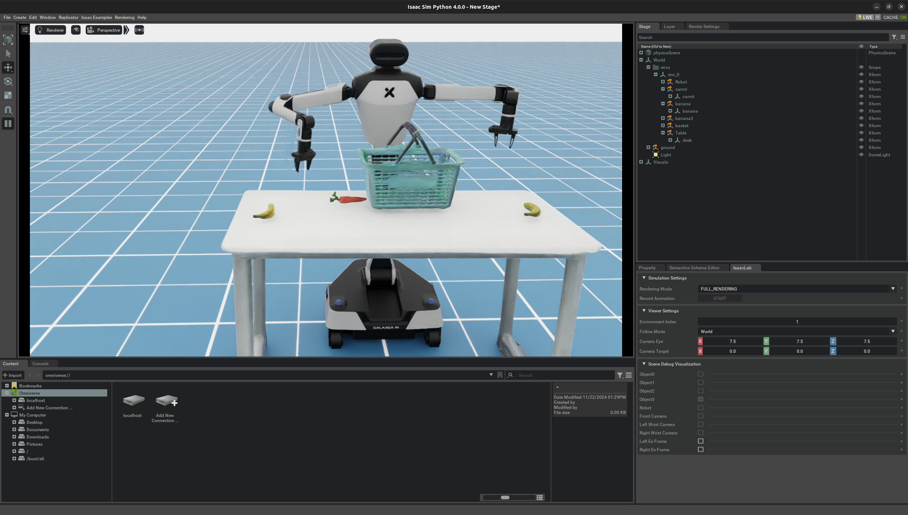

# Galaxea A1 Simulation Isaac Sim Tutorial  

[official tutorial](http://galaxea.tech/Product_User_Guide/Guide/R1/Simulation_Isaac_Lab_Tutorial/#define-observation-action-reward-etc)  

## Installation

As you wish. First, install **Isaac Sim**.  

`git clone https://github.com/userguide-galaxea/Galaxea_Lab.git`  

**From now on, you can refer to the tutorial of** [Isaac Lab binary installation guide](https://isaac-sim.github.io/IsaacLab/main/source/setup/installation/binaries_installation.html#installing-isaac-lab).  

After installation, the robot works well (~stupidly~)   

## Code Reading  
[Minimal Excutable Code Unit](/Galaxea%20R1/notebook/code_Minimal_Excutable_Code_Unit.md)  
[__init__](/Galaxea%20R1/notebook/code_init.md)  
[pick fruit env](/Galaxea%20R1/notebook/code_pick_fruit_env.md)
