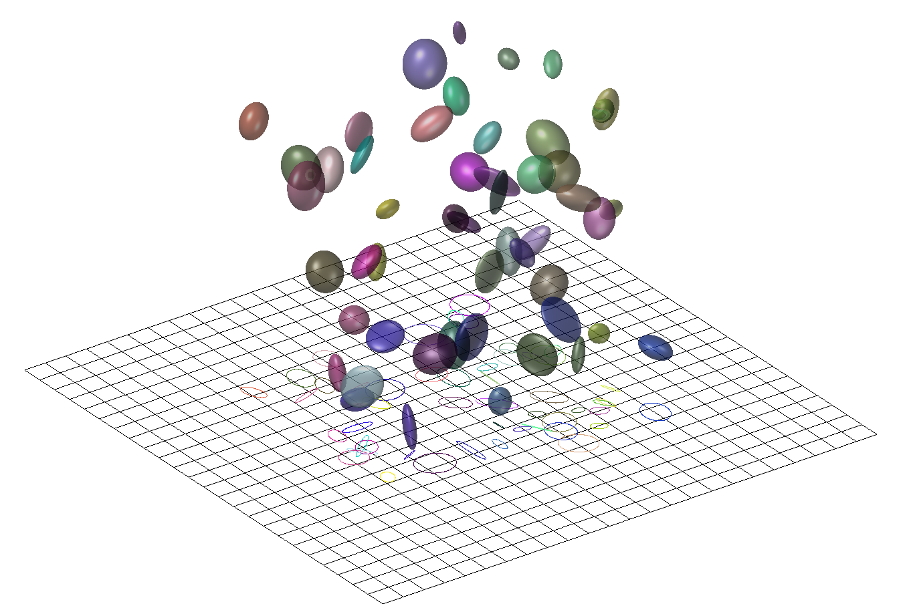

# 3D Gaussian Splatting for Real-Time Radiance Field Rendering  

>key words: **high-quality**, **real-time**, **novel-view**, **unbounded and complete scenes**  

***Tree Key Elements:***  
- starting from *sparse points produced during camera calibration*, we represent the scene with **3D Gaussians** that preserve desirable properties of *continuous volumetric radiance fields* for scene optimization while avoiding unnecessary computation in empty space  

>**Camera Calibration:**  
This process involves determining the intrinsic and extrinsic parameters of the camera, which allows for accurate understanding of the relationship between the camera and objects in the scene. *Sparse points generated* during calibration are often used as the basis for scene reconstruction.  

>**3D Gaussians:**  
A mathematical model used to represent *uncertainty or distribution* of points or regions in 3D space. By using 3D Gaussians, each point in the scene **not only has a spatial coordinate but also represents a potential distribution** (such as volume density), which is highly effective for modeling continuous volumetric radiance fields.  

>**Continuous Volumetric Radiance Fields:**  
This refers to the **volume density** and **radiance** at every point in the scene, which can be estimated through volume rendering techniques. The use of 3D Gaussians enables the scene to *maintain these continuous radiance properties* while allowing for scene optimization.

- perform **interleaved optimization/density contrl of the 3D Gaussians**, notably optimizing **anisotropic convariance** to achieve an accurate representation of the scene  

>**Interleaved Optimization/Density Control:**  
This refers to the alternating optimization of different parameters. In this context, it involves optimizing both the density (i.e., the weight and spread of each 3D Gaussian distribution) and the associated covariance structure.  

>**Anisotropic Covariance:**  
The covariance matrix describes the relationship between random variables. Anisotropy means that the *covariance may differ in different directions* (as opposed to isotropy, where covariance is the same in all directions). Optimizing anisotropic covariance in 3D Gaussians aims to more accurately represent the geometry and details of the scene, capturing directionally varying features in the real world.

-  a fast **visibility-aware rendering** algorithm that supports **anisotropic splatting** and both accelerates trainning and allows real-time rendering  

>**Visibility-aware Rendering Algorithm:**  
This means that the rendering algorithm takes into account *which parts of the scene are visible* (i.e., observable), and allocates computational resources more efficiently by *rendering only the visible parts*. This reduces unnecessary computation and speeds up the rendering process.  

>**Anisotropic Splatting:**  
**Splatting** is a rendering technique often used to spread image or geometric information *from discrete sample points to a continuous space*. Anisotropic splatting refers to the process where the influence of sample points is spread differently in different directions, meaning **the rendering effect adjusts based on the orientation** (or other geometric information) of the sample points. This method is more flexible than traditional isotropic splatting and can better capture directional geometric features in a scene.  

## Introduction  

- *meshes* and *points* $\Rightarrow$ explicit, good fit for fast GPU/CUDA-based rasterization  
- NeRF $\Rightarrow$ optimizing a Multi-Layer Perceptron (MLP) using *volumeric* ray-marching  
- *interpolaing values* is the most efficient radiance field solutions to date build on continuous representations  
$\Rightarrow$ stochastic sampling is costly and can result in noise  

**tile-base splatting solution**  

**Three main components:**  
- initialize the set of 3D Gaussions with the **sparse point cloud** produced for free as part of the SfM (Structure-from-Motion) process $\Rightarrow$ only SfM points as input or even *random initialization*  

>**Structure-from-Motion (SfM):**  
SfM is a computer vision technique aimed at reconstructing the 3D structure of a scene and estimating the positions and orientations of the cameras from a series of 2D images. By analyzing the relative motion between images, SfM can reconstruct the 3D geometry of the scene from multiple viewpoints.  
The initial reconstruction in SfM is usually **sparse**, meaning it uses a small number of feature points to reconstruct the scene.  

- optimization of the properties of the 3D Gaussians - **3D position, opacity $\alpha$, anisotropic covariance, and spherical harmonic (SH) coefficients** $\Rightarrow$ *compact, unstructured, and precise representation of the scene*    
- real-time rendering solution (fast GPU sorting algorithms, tile-based rasterization)  
  - 3D Gaussian representaion $\Rightarrow$ perform **anisotropic splatting** that *respects visibility ordering* (sorting, $\alpha$ blending)  
  - a fast and accurate *backward pass* by tracking the traversal of as many sorted splats as required  

