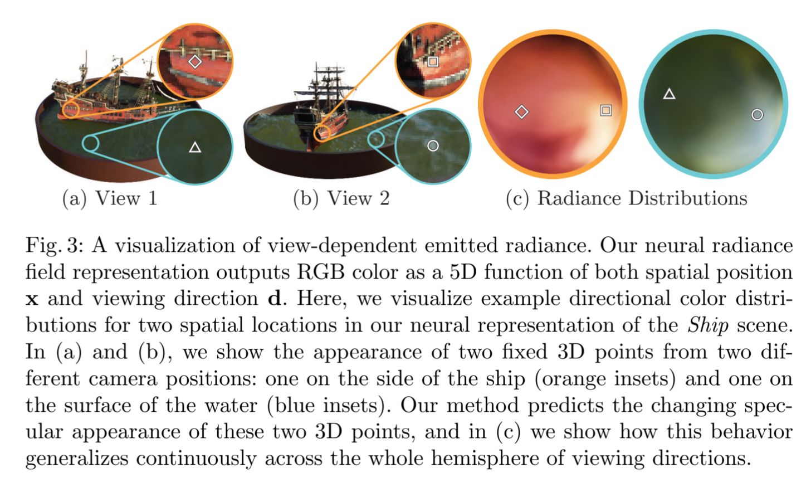

# NeRF: Representing Scenes as Neural Radiance Fields for View Synthesis  

>*keywords:* view synthesis, image-based rendering, volume rendering, 3D deep learning  

## 1. Introduction  

***Problem:*** view synthesis  

- represent a static scene as a continuous 5D function $\Rightarrow$ $(x, y, z)\;(\theta, \phi)$  
- outputs the **radiance** emmitted in each point  
- a **density** at each point $\Rightarrow$ differential opacity controlling how much radiance is accumulated by a ray passing through $(x, y, z)$  
- MLP  
- transforming input 5D coordinates with a **positional encoding**  
- **hierarchical sampling procedure**  
- novel views  

  

?>**MLP**  
*MLP (Multilayer Perceptron)* is a type of feedforward neural network that typically consists of multiple layers, including an **input layer**, **hidden layers**, and an **output layer**. Each layer is composed of multiple neurons (nodes) connected to each other through weighted connections.

## 2. Related Work  

## 3. Neural Radiance Field Scene Representation  

>5D vector-valued function: 3D location $\mathcal{x} = (x, y, z)$ + 2D viewing direction $(\theta, \phi)$ [as a 3D Cartesian unit vector $\mathcal{d}$]  
>$\Rightarrow$ emitted color $\mathcal{c} = (r, g, b)$ + volume density $\sigma$  
>with an MLP network $F_{\Theta}: (\mathcal{x}, \mathcal{d}) \rightarrow (\mathcal{c}, \sigma)$  

$\sigma$ as a function of only $\mathcal{x}$ $\Rightarrow$ $\mathcal{x}$ $\mathop{\longrightarrow} \limits^{\text{8\;fully-connected\;layers}} \sigma$ and a 256-demensional feature vector  
$\mathcal{c}$ as a function of both $\mathcal{x}$ and $\mathcal{d}$ $\Rightarrow$ the feture vector concatenated with $\mathcal{d}$ $\mathop{\longrightarrow} \limits^{\text{additional fully-connected layer}} \mathcal{c}$  

  

## 4. Volume Rendering with Radiance Fields  

>for camera ray $\mathcal{r}(t)=\mathcal{o}+t\mathcal{d}$, the expected color $C(\mathcal{r})$ with near and far bounds $t_n$ and $t_f$ is:  
><mark>
>$$
>C(\mathcal{r}) = \int_{t_n}^{t_f}T(t)\sigma(\mathcal{r}(t))\mathcal{c}(\mathcal{r}(t), \mathcal{d})dt
>$$
></mark>  

- $T(t)$: the light transmittance from $t_n$ to $t$ $\Rightarrow$ $T(t) = exp(-\int_{t_n}^t \sigma(\mathcal{r}(s))ds)$  

estimate using **Deterministic quadrature**  
using a stratified sampling approach $\Rightarrow$ partition $[t_n, t_f]$ into $N$ evenly-spaced bins:  
$$
t_i \sim \mathcal{U}[t_n + \frac{i-1}{N}(t_f - t_n), t_n + \frac{i}{N}(t_f - t_n)]
$$  

$\Rightarrow$ 
$$
\hat{C}(r) = \sum_{i = 1}^N T_i(1 - exp(-\sigma_i\delta_i))c_i \text{ , where } T_i = exp(-\sum_{j = 1}^{i - 1}\sigma_j\delta_j)
$$  
- $\delta_i = t_{i+1} - t_i$ is the distance between adjacent samples  

?>**Deterministic quadrature**  
*Deterministic quadrature* is a numerical integration method used to approximate the integral of a continuous function by using a set of fixed sampling points. In this method, the integration interval is divided into several sub-intervals, and a specific sampling point is selected within each sub-interval. The function values at these points are then weighted and summed to estimate the integral over the entire interval.  

?>**alpha compositing**  
In computer graphics, *alpha compositing* is the process of combining one image with a background to create the appearance of partial or full transparency. It is often useful to render picture elements (pixels) in separate passes or layers and then combine the resulting 2D images into a single, final image called the *composite*.  
$I_c = \alpha_f I_f + (1-\alpha_f)I_b$  

  

## 5. Optimizing a Neural Radiance Field  

### 5.1 Positional encoding (different from *Transformer*)  

deep networks are biased towards learning *lower frequency* functions  
**solution:** mapping the inputs to a *higher dimensional space* using high frequency functions  

>reformulating $F_\theta$ as a compusition of two functions $F_\theta = F_\theta^{\prime} \circ \gamma$ $\Rightarrow$ $\gamma$ is a mapping from $\mathbb{R}$ into a higher dimensional space $\mathbb{R}^{2L}$  
>$$
>\gamma(p) = (sin(2^0\pi p), cos(2^0 \pi p), ..., sin(2^{L-1}\pi p), cos(2^{L-1}\pi p))
>$$  

### 5.2 hierarchical volume sampling  

**Inefficiency:** *free space* and *occluded regions* are sampled repeatedly  

>***Two networks***: one "coarse" and one "fine"  
>- sample a set of $N_c$ location using stratified sampling and evaluate the "coarse" network at these locations  
>- produce a more informed sampling of points along each ray where *samples are biased towards the relevant parts of the volume*  

rewrite the alpha composited color from the coarse network $\hat{C}_c(r)$  
$$
\hat{C}_c(r) = \sum_{i = 1}^{N_c}w_i c_i, w_i = T_i(1 - exp(-\sigma_i \delta_i))
$$  

- Normalizing the weights as $\hat{w_i} = \frac{w_i}{\sum_{j = 1}^{N_c}}w_j$ produces ***a piecewise-constant PDF*** along the ray  
- sample $N_f$ locations from this distribution using ***inverse transform sampling***  
- compute the final rendered color using all $N_c + N_f$ samples  

?>**Inversed Transform Sampling**  
*Inverse transform sampling* is a technique used to generate samples from a given probability distribution. The idea is to transform a uniformly distributed random variable into a variable that follows the target distribution by applying the inverse of the cumulative distribution function (CDF) of that distribution.  

### 5.3 Implementation details  

