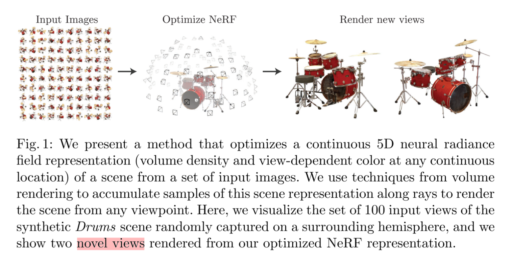

# NeRF: Representing Scenes as Neural Radiance Fields for View Synthesis  

>*keywords:* view synthesis, image-based rendering, volume rendering, 3D deep learning  

## 1. Introduction  

***Problem:*** view synthesis  

- represent a static scene as a continuous 5D function $\Rightarrow$ $(x, y, z)\;(\theta, \phi)$  
- outputs the **radiance** emmitted in each point  
- a **density** at each point $\Rightarrow$ differential opacity controlling how much radiance is accumulated by a ray passing through $(x, y, z)$  
- MLP  
- transforming input 5D coordinates with a **positional encoding**  
- **hierarchical sampling procedure**  
- novel views  

  

?>**MLP**  
*MLP (Multilayer Perceptron)* is a type of feedforward neural network that typically consists of multiple layers, including an **input layer**, **hidden layers**, and an **output layer**. Each layer is composed of multiple neurons (nodes) connected to each other through weighted connections.

## 2. Related Work  

## 3. Neural Radiance Field Scene Representation  

>5D vector-valued function: 3D location $\mathcal{x} = (x, y, z)$ + 2D viewing direction $(\theta, \phi)$ [as a 3D Cartesian unit vector $\mathcal{d}$]  
>$\Rightarrow$ emitted color $\mathcal{c} = (r, g, b)$ + volume density $\sigma$  
>with an MLP network $F_{\Theta}: (\mathcal{x}, \mathcal{d}) \rightarrow (\mathcal{c}, \sigma)$  

$\sigma$ as a function of only $\mathcal{x}$ $\Rightarrow$ $\mathcal{x}$ $\mathop{\longrightarrow} \limits^{\text{8\;fully-connected\;layers}} \sigma$ and a 256-demensional feature vector  
$\mathcal{c}$ as a function of both $\mathcal{x}$ and $\mathcal{d}$ $\Rightarrow$ the feture vector concatenated with $\mathcal{d}$ $\mathop{\longrightarrow} \limits^{\text{additional fully-connected layer}} \mathcal{c}$  

  

## 4. Volume Rendering with Radiance Fields  

>for camera ray $\mathcal{r}(t)=\mathcal{o}+t\mathcal{d}$, the expected color $C(\mathcal{r})$ with near and far bounds $t_n$ and $t_f$ is:  
><mark>$C(\mathcal{r}) = \int_{t_n}^{t_f}T(t)\sigma(\mathcal{r}(t))\mathcal{c}(\mathcal{r}(t), \mathcal{d})dt$</mark>  

- $T(t)$: the light transmittance from $t_n$ to $t$ $\Rightarrow$ $T(t) = exp(-\int_{t_n}^t \sigma(\mathcal{r}(s))ds)$  

