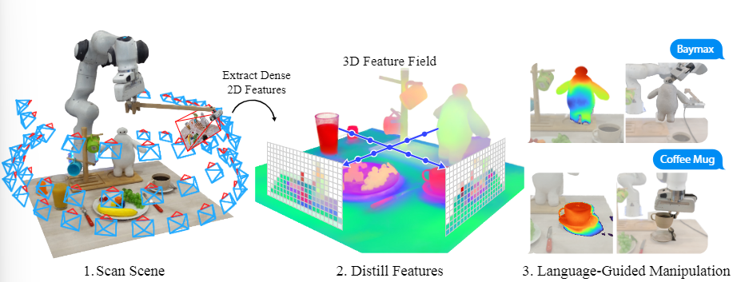

# Distilled Feature Fields Enable Few-Shot Language-Guided Manipulation

>*keywords:* **Distilled Feature Fields, Few-Shot, 2D-to-3D, Language-Guided Manipulation**

## Abstract

- 2D-to-3D for 3D geometry $\Rightarrow$ accurate 3D geometry & 2D rich semantics
- *6-DOF grasping and placing* with few-shot learning method
- achieve in-the-wild generalization to unseen objects
- *features distilled fields* $\Rightarrow$ vision-language model, *CLIP*

## Introduction

- given a *few grasping demonstrations or text descriptions* without having previously seen a similar item $\Rightarrow$ pre-trained image embeddings

### workflow

*Step1:* scan scene by taking a sequence of photos
*Step2:* construct a *neural radiance field* **(NeRF)**, produce *Distilled Feature Field* **(DFF)**
*Step3:* reference demonstrations and language instructions to grasp objects

?>**NeRF**
>pre-trained vision foundation model (neural network) providing *image features*
>mutiple 2D images $\Rightarrow$ 3D scene  representation called *DFF*
>DFF embeds knowledge from 2D feature maps into a 3D volume

- **DINO ViT**, *a self-supervised vision transformers* provides features (out-of-the-box visual descriptors for dense correspondence)
- **CLIP**, *a vision-language model*, a strong <u>zero-shot</u> learner on various vision and visual question-answering tasks

### challenge

- *modeling time* $\Rightarrow$ *hierarchical hashgrids*

?>**Hierarchical Hashgrids**
>Hierarchical hashgrids is a technique used to accelerate data querying and storage in 3D space. 
>It organizes data using a *multi-level hash grid* structure, allowing for fast lookup and insertion operations.

- *vision-language features:* *CLIP* produce image-level features, 3D feature distillation requires dense 2D descriptors $\Rightarrow$ *MaskCLIP* reparameterization trick, extracting dense patch-level features from CLIP 