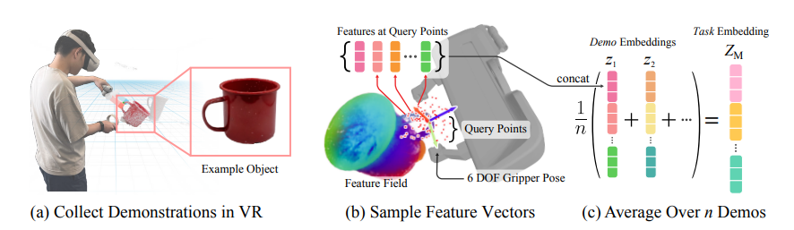
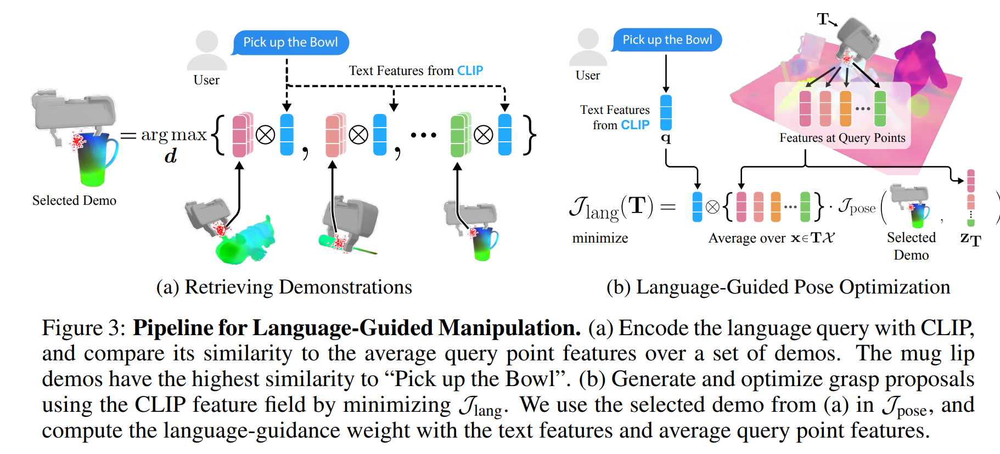

# Distilled Feature Fields Enable Few-Shot Language-Guided Manipulation

>*keywords:* **Distilled Feature Fields, Few-Shot, 2D-to-3D, Language-Guided Manipulation**

## Abstract

- 2D-to-3D for 3D geometry $\Rightarrow$ accurate 3D geometry & 2D rich semantics  
- *6-DOF grasping and placing* with few-shot learning method  
- achieve in-the-wild generalization to unseen objects  
- *features distilled fields* $\Rightarrow$ vision-language model, *CLIP*  

## 1. Introduction

- given a *few grasping demonstrations or text descriptions* without having previously seen a similar item $\Rightarrow$ pre-trained image embeddings  
- **DINO ViT**, *a self-supervised vision transformers* provides features (out-of-the-box visual descriptors for dense correspondence)  
- **CLIP**, *a vision-language model*, a strong <u>zero-shot</u> learner on various vision and visual question-answering tasks  
- rich visual and language priors within 2D foundation models $\Rightarrow$ *generalize to new categories of objects*  

### workflow

***Step1:*** scan scene by taking a sequence of photos  
***Step2:*** construct a *neural radiance field* **(NeRF)**, produce *Distilled Feature Field* **(DFF)**  
***Step3:*** reference demonstrations and language instructions to grasp objects  

?>**NeRF**  
pre-trained vision foundation model (neural network) providing *image features*  
mutiple 2D images $\Rightarrow$ 3D scene  representation called *DFF*  
DFF embeds knowledge from 2D feature maps into a 3D volume  

### challenge

- *modeling time* $\Rightarrow$ *hierarchical hashgrids*  

?>**Hierarchical Hashgrids**  
Hierarchical hashgrids is a technique used to accelerate data querying and storage in 3D space.   
It organizes data using a *multi-level hash grid* structure, allowing for fast lookup and insertion operations.  

- *vision-language features:* *CLIP* produce image-level features, 3D feature distillation requires dense 2D descriptors $\Rightarrow$ *MaskCLIP* reparameterization trick, extracting dense patch-level features from CLIP   

## 2. Problem Formulation

>- a single rigid-body transformation is parameterized as ${T} \in {SE(3)}$  
>- parameterize a 6-DOP grasp or place pose as ${T} = {(R, t)}$, ${R}$ is the rotation matrix, ${t}$ is the ranslation vector  
>- given a set of RGB images $\{ {I} \}$ with corresponding camera poses  

### Few-Shot Manipulation

***learning:*** each demonstration ${D}$ consists of the tuple $\langle \{ {I} \} , {T}^*\rangle$, ${T}^*$ is a pose that accomplishes the desired task  

***testing:*** given multiple images $\{ {I}^\prime \}$ of a new scene which may contain distractor objects and clutter $\Rightarrow$ predict a pose ${T}$ that achieves the task  

>want to test for *open-ended generalization*: the new scene contains related but previously unseen objects that differ from the demo objects  

### Open-Text Language-Guided Manipulation

***testing:*** provides the robot with a text query ${L}^+$ to specify which object to manipulate and negative texts ${L}^-$ to reject distractors  

>${L}^-$ can be sampled automatically (?)  

## 3. Feature Fields for Robotic Manipulation (F3RM)  

**Three Separate Problem:**  
- produce the feature field of a scene automatically at a reasonable speed  
- represent and infer 6-DOF grasping and placing poses  
- incorporate language guidance to enable open-text commands  
 
### 3.1 Feature Field Distillation  

**Distilled Feature Fields (DFFs)** are an extension of NeRF that aim to generate richer 3D representations by incorporating features from a vision model. 
including an additional output to reconstruct *dense 2D features* from a vision model $f_{vis}$

$f: 3D {\space} position {\space} x {\space}\mapsto {\space} a {\space} feature {\space} vector {\space} f(x)$  

each feature vector is given by the feature rendering integral between the near and far plane ($t_n$ and $t_f$):  

$F(r)=\int_{t_n}^{t_f}T(t)\sigma(r_t)f(r_t)dt$ ,with $T(t)=exp(-\int_{t_n}^{t}\sigma(r_s)ds)$  

#### Feature Distillation  
$N$ 2D feature maps $\{I^f_i\}^N_{i=1}$, $I^f=f_{vis}(I)$  
optimize $f$ by minimizing the quadratic loss $L_{feat}=\sum_{r\in{R}}||\hat{F}(r)-I^f(r)||_2^2$  

#### Extracting Dense Visual Features from CLIP  
**CLIP Modification**
- extract dense features from CLIP using the *MaskCLIP* reparameterization trick  
These features retain a *sufficient alignment* with the language embedding to support zero-shot language guidance   
- interpolate the *position encoding* to accommodate larger images  

?>**CLIP**  
**CLIP (Contrastive Language-Image Pretraining)** is a model proposed by OpenAI designed to jointly train image and text through a contrastive learning approach to achieve multimodal understanding. CLIP *embeds images and text into the same feature space*, enabling it to understand and generate descriptions of images or generate corresponding images from text.  

***target:*** *dense, high-resolution patch-level* 2D features from RGB images at about 25 frames per second and does not require fine-tuning CLIP  

### 3.2 Representing 6-DOF Pose with Feature Fields  

***target:*** represent *the pose of the gripper* in a demonstration by the local 3D feature field in the
gripper's coordinate frame  

approximate this local context via *a discrete set of query points* and *the feature vectors measured at each point*  
- sample a fixed set of $N_q$ query points $\mathcal{X} = \{x\in \mathbb{R}^3 \}_{N_q}$ in the canonical gripper frame for each task $M$ from a 3D Gaussian  
- adjust its mean and variance manually to cover parts of the objects we intend to targets, as well as important context cues  
-  For a 6-DOF gripper pose $T$, we sample the feature field $f$ at each point in the query point cloud, transformed by $T$  
- the occupancy given by the local geometry $\Rightarrow$ *$\alpha$-weighted features*  
 $f_{\alpha}=\alpha(x)\cdot f(x)$, where $\alpha (x)=1-exp(-\sigma(x) \cdot \delta)\in (0, 1)$  

?>
**Density Field $\sigma$:** In a NeRF model, the density field represents *the distribution of objects in space*. A higher density value means the object is more opaque or solid at that point, indicating the object’s occupancy in the voxel.  
  
**$\alpha$ value (transparency):** Alpha values are computed by integrating the density field over a voxel, reflecting *the transparency or opacity of the region*. High alpha values suggest that the voxel is occupied by an object, while low values indicate that the voxel is mostly empty or free space.  
 
**Feature weighting:** At each point $x$ in the scene, the features extracted from that region are weighted by the corresponding alpha value. This means that *regions with high transparency (i.e., dense objects) will have more influence in the feature representation*, while regions with low transparency (mostly empty space) will have less influence.  

sample a set of feature:  
$\{f_{\alpha}(x)|x\in T\mathcal{X}\}$  
and concatenate along the feature-dimension into a vector, $z_T\in \mathbb{R}^{N_q\cdot|f|}$  
$\Rightarrow$ query points $\mathcal{X}$ and demo embedding $z_T$ jointly encode the demo pose $T$  

each manipulation task $M$ specified by a set demonstrations $\{D\}$:  
average $z_T$ over the demos for the same task $\Rightarrow$ *task embedding* $Z_M\in \mathbb{R}^{{N_q}\cdot|f|}$  

?>**To Sum Up**  
***Step1-Sample Query Points:*** for each task $M$, sample $N_q$ query points $\mathcal{X}=\{x\in \mathbb{R}^3 \}_{N_q}$ $\Leftarrow$ 3D Gaussian  
 
***Step2-Sample Feature Field:*** for each 6-DOF gripper pose $T$, $\mathcal{X} \Rightarrow T\mathcal{X}$; calculate $\alpha$-weighted features using the NeRF density field $\sigma$, $f \Rightarrow f_{\alpha}$  
 
***Step3-Feature Concatenation:*** at each point, do $\{f_{\alpha}(x)|x\in T\mathcal{X}\}$, concatenate the weight features $f_{\alpha}(x)$ along the feature dimension into a vector $z_T$, representing the current pose $T$  
 
***Step4-Task Embedding Generation:*** for multiple demonstrations $\{D\}$ for each task, average $z_T \Rightarrow Z_M$  

  

#### Inferring 6-DOF Pose  

***Step1:*** coarse pre-filtering step  
***Step2:*** optimization-based fine-tuning step  

- sample a dense voxel grid over the workspace $\Leftarrow$ voxel $v$ has a grid-size $\delta$  
- remove free space $\Leftarrow$ rejecting $\alpha(v)<\epsilon_{free}$  
- remove voxels that are irrelevant to the task $\Leftarrow$ cosine similarity between the voxel feature $f_{\alpha}(v)$ and the task embedding $Z_M$  
- to get the complete 6-DOF poses $\mathcal{T}=\{T\}$ $\Leftarrow$ sample $N_r$ rotations for each remaining voxel $v$  

#### Pose Optimization  

initial poses optimization:  
$\mathcal{J}_{pose}(T)=-cos(z_T, Z_M)$  

- optimize the initial poses using the *Adam* optimizer to search for poses that have the highest similarity to the task embedding $Z_M$  

?>**Adam Optimizer**  
The Adam optimizer is a **gradient-based** optimization algorithm commonly used for training deep learning models. It combines the advantages of *Momentum* and *RMSProp*, applying an adaptive learning rate for each parameter and introducing momentum to speed up convergence and improve stability.  

- prune pose that have the highest costs  
- reject poses that are in collision  

$\Rightarrow$ a ranked list of poses that we feed into a motion planner in PyBullet  

### 3.3 Open-Text Language-Guided Manipulation  

**Language-guided Pose Inference Procedure**  
***Step1:*** retrieving relevant demonstrations  
***Step2:*** initailizing coarse grasps  
***Step3:*** language-guided grasp pose optimization  

#### Retrieving Relevant Demonstrations  

finding the demonstrations that maximizes the cosine similarity $cos(q, F_d)$  
>$F_d$: averaged among the query points of each demo pose $T^*$  
>$q$: text embedding $q=emb_{CLIP}(L^+)$ $\Rightarrow$ using the positive query text $(L^+) alone is sufficient$   

#### Initializing Grasp Proposals  

- first running a coarse proposal  
- sampling a dense voxel grid among the occupied regions by *masking out free space*  
- prune down the number of voxels $\Leftarrow$ keeping those *more similar to the positive query $L^+$* than any one of the negative queries $L^-$  
  - compute the **softmax** over the pair-wise cosine similarity between the voxel's feature $f_{\alpha}(v)$ and the ensemble $[q, q_1^-, q_2^-, ... , q_n^-]$  
  - identify the closest $q^-$  
  - remove voxels that are closer to $q^-$ than positive query $q$ $\Leftarrow$ binomial distribution    
- to get the set of initial poses $\mathcal{T}=\{T\}$, sample $N_r$ rotations for each remaining voxel

#### Language-Guided Grasp Pose Optimization  

$\mathcal{J}_{lang}(T)=\mathop{mean}\limits_{x\in T\mathcal{X}}[q \otimes f_{\alpha}(x)]\cdot\mathcal{J}_{pose}(T)$  
- language-guidance weight $C_q=\mathop{mean}\limits_{x\in T\mathcal{X}}[q \otimes f_{\alpha}(x)]$ is the normalized cosine similarity between the text embedding $q$ and the average $\alpha$-weighted query feature for a pose $T$  
- interatively update the pose $T$ via *gradient descent* while pruning  

  

!>Summary for F3RM  
- *Feature Field Distillation*  
  - Feature Distillation $\Leftarrow$ **NeRF**  
  - Extracting Dense Visual features $\Leftarrow$ **CLIP**  
- *Representing 6-DOF Pose with Feature Fields*  
  - Sample Query Points $\mathcal{X}$ $\Leftarrow$ **3D Gaussian**  
  - Sample Feature Field: $\mathcal{X} \Rightarrow T\mathcal{X}$; $f \Rightarrow f_{\alpha}$  
  - Feature Concatenation: concatenate $f_{\alpha}(x)$ into $z_T$ represent pose $T$
  - Task Embedding Generation: $z_T \Rightarrow Z_M$  
- *Inferring 6-DOF Pose*  
- *Pose Optimization*  
- *Open-Text Language-Guided Manipulation*  
  - Retrieving Relevant Demonstrations $\Leftarrow$ maximizes $cos(q, F_d)$  
  - Initializing Grasp Proposals   
  - Language-Guided Grasp Pose Optimization $\Leftarrow$ $\mathcal{J}_{lang}(T)=\mathop{mean}\limits_{x\in T\mathcal{X}}[q \otimes f_{\alpha}(x)]\cdot\mathcal{J}_{pose}(T)$  