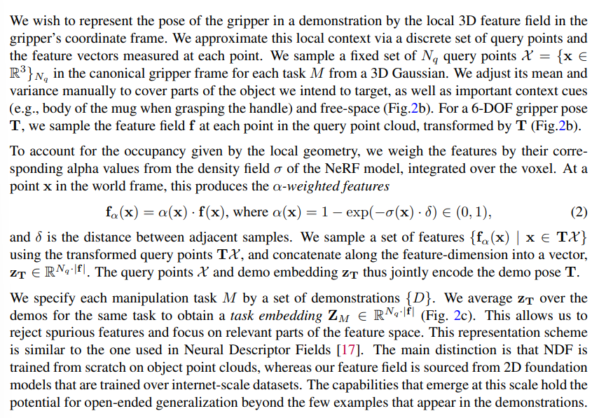

# Distilled Feature Fields Enable Few-Shot Language-Guided Manipulation

>*keywords:* **Distilled Feature Fields, Few-Shot, 2D-to-3D, Language-Guided Manipulation**

## Abstract

- 2D-to-3D for 3D geometry $\Rightarrow$ accurate 3D geometry & 2D rich semantics  
- *6-DOF grasping and placing* with few-shot learning method  
- achieve in-the-wild generalization to unseen objects  
- *features distilled fields* $\Rightarrow$ vision-language model, *CLIP*  

## 1. Introduction

- given a *few grasping demonstrations or text descriptions* without having previously seen a similar item $\Rightarrow$ pre-trained image embeddings  
- **DINO ViT**, *a self-supervised vision transformers* provides features (out-of-the-box visual descriptors for dense correspondence)  
- **CLIP**, *a vision-language model*, a strong <u>zero-shot</u> learner on various vision and visual question-answering tasks  
- rich visual and language priors within 2D foundation models $\Rightarrow$ *generalize to new categories of objects*  

### workflow

*Step1:* scan scene by taking a sequence of photos  
*Step2:* construct a *neural radiance field* **(NeRF)**, produce *Distilled Feature Field* **(DFF)**  
*Step3:* reference demonstrations and language instructions to grasp objects  

?>**NeRF**  
pre-trained vision foundation model (neural network) providing *image features*  
mutiple 2D images $\Rightarrow$ 3D scene  representation called *DFF*  
DFF embeds knowledge from 2D feature maps into a 3D volume  

### challenge

- *modeling time* $\Rightarrow$ *hierarchical hashgrids*  

?>**Hierarchical Hashgrids**  
Hierarchical hashgrids is a technique used to accelerate data querying and storage in 3D space.   
It organizes data using a *multi-level hash grid* structure, allowing for fast lookup and insertion operations.  

- *vision-language features:* *CLIP* produce image-level features, 3D feature distillation requires dense 2D descriptors $\Rightarrow$ *MaskCLIP* reparameterization trick, extracting dense patch-level features from CLIP   

## 2. Problem Formulation

>- a single rigid-body transformation is parameterized as ${T} \in {SE(3)}$  
>- parameterize a 6-DOP grasp or place pose as ${T} = {(R, t)}$, ${R}$ is the rotation matrix, ${t}$ is the ranslation vector  
>- given a set of RGB images $\{ {I} \}$ with corresponding camera poses  

### Few-Shot Manipulation

*learning:* each demonstration ${D}$ consists of the tuple $\langle \{ {I} \} , {T}^*\rangle$, ${T}^*$ is a pose that accomplishes the desired task  

*testing:* given multiple images $\{ {I}^\prime \}$ of a new scene which may contain distractor objects and clutter $\Rightarrow$ predict a pose ${T}$ that achieves the task  

>want to test for *open-ended generalization*: the new scene contains related but previously unseen objects that differ from the demo objects  

### Open-Text Language-Guided Manipulation

*testing:* provides the robot with a text query ${L}^+$ to specify which object to manipulate and negative texts ${L}^-$ to reject distractors  

>${L}^-$ can be sampled automatically (?)  

## 3. Feature Fields for Robotic Manipulation (F3RM)  

>Three Separate Problem  
- produce the feature field of a scene automatically at a reasonable speed  
- represent and infer 6-DOF grasping and placing poses  
- incorporate language guidance to enable open-text commands  
 
### 3.1 Feature Field Distillation  

**Distilled Feature Fields (DFFs)** are an extension of NeRF that aim to generate richer 3D representations by incorporating features from a vision model. 
including an additional output to reconstruct *dense 2D features* from a vision model $f_{vis}$

$f: 3D {\space} position {\space} x {\space}\mapsto {\space} a {\space} feature {\space} vector {\space} f(X)$  

each feature vector is given by the feature rendering integral between the near and far plane ($t_n$ and $t_f$):  

$F(r)=\int_{t_n}^{t_f}T(t)\sigma(r_t)f(r_t)dt$ with $T(t)=exp(-\int_{t_n}^{t}\sigma(r_s)ds)$  

#### Feature Distillation  
$N$ 2D feature maps $\{I^f_i\}^N_{i=1}$, $I^f=f_{vis}(I)$  
optimize $f$ by minimizing the quadratic loss $L_{feat}=\sum_{r\in{R}}||\hat{F}(r)-I^f(r)||_2^2$  

#### Extracting Dense Visual Features from CLIP  
**CLIP Modification**
- extract dense features from CLIP using the *MaskCLIP* reparameterization trick  
These features retain a *sufficient alignment* with the language embedding to support zero-shot language guidance   
- interpolate the *position encoding* to accommodate larger images  

*target:* *dense, high-resolution patch-level* 2D features from RGB images at about 25 frames per second and does not require fine-tuning CLIP  

### 3.2 Represnting 6-DOF Pose with Feature Fields  

*target:* represent *the pose of the gripper* in a demonstration by the local 3D feature field in the
gripper's coordinate frame  

Can't really understand.  
>"For a 6-DOF gripper pose T, we sample the feature field f at each point in the query point cloud, transformed by T"  

  

#### Inferring 6-DOF Pose  

*Step1:* coarse pre-filtering step  
*Step2:* optimization-based fine-tuning step  

- sample a dense voxel grid over the workspace $\Leftarrow$ voxel $v$ has a grid-size $\delta$  
- remove free space $\Leftarrow$ rejecting $\alpha(v)<\epsilon_{free}$  
- remove voxels that are irrelevant to the task $\Leftarrow$ cosine similarity  
- to get the complete 6-DOF poses $\mathcal{T}=\{T\}$ $\Leftarrow$ sample $N_r$ rotations for each remaining voxel $v$  

#### Pose Optimization  

initial poses optimization:  
$\mathcal{J}_{pose}(T)=-cos(z_T, Z_M)$  

- optimize the initial poses using the *Adam* optimizer to search for poses that have the highest similarity to the task embedding $Z_M$  
- prune pose that have the highest costs  
- reject poses that are in collision  

$\Rightarrow$ a ranked list of poses that we feed into a motion planner in PyBullet  

### 3.3 Open-Text Language-Guided Manipulation  

**Language-guided Pose Inference Procedure**  
*Step1:* retrieving relevant demonstrations  
*Step2:* initailizing coarse grasps  
*Step3:* language-guided grasp pose optimization  

#### Retrieving Relevant Demonstrations  

